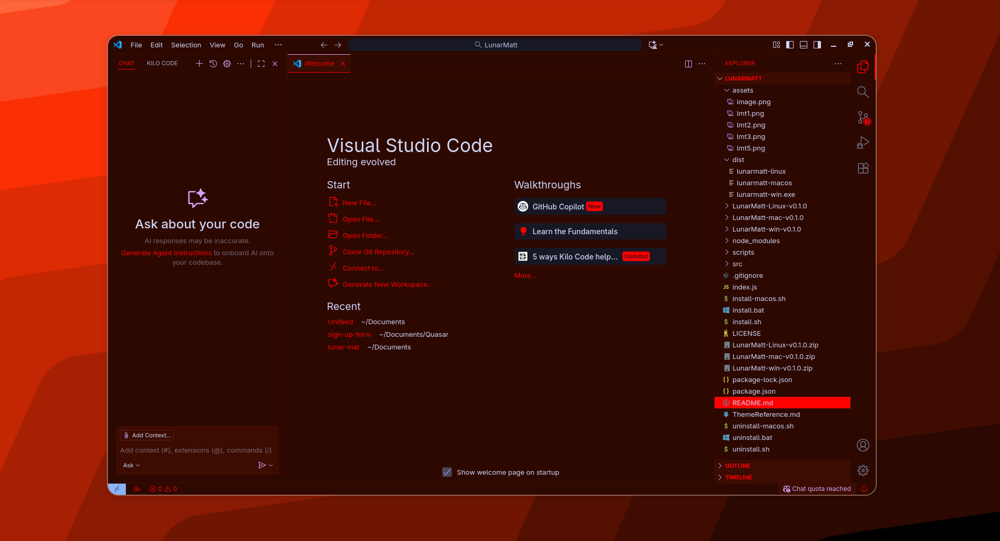
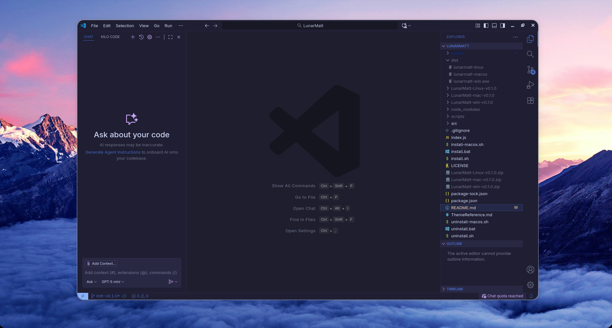
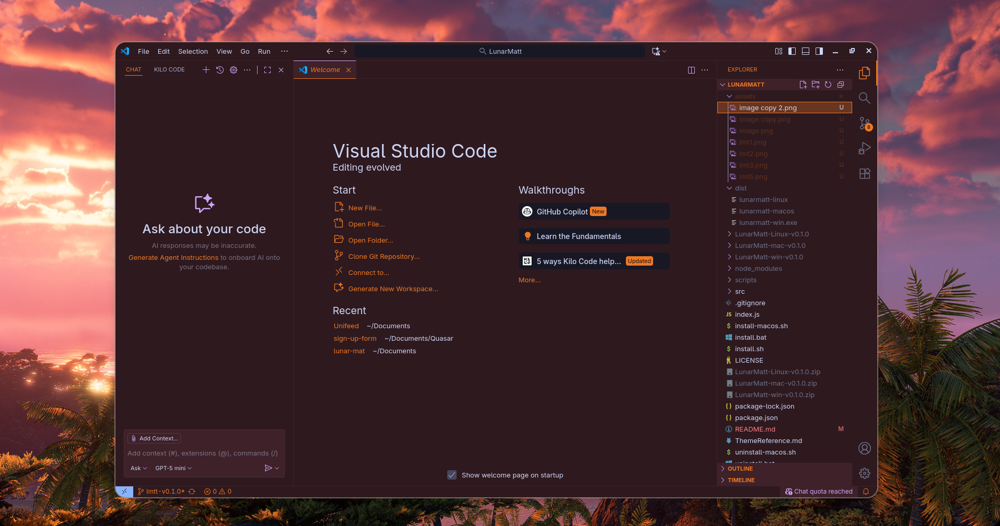
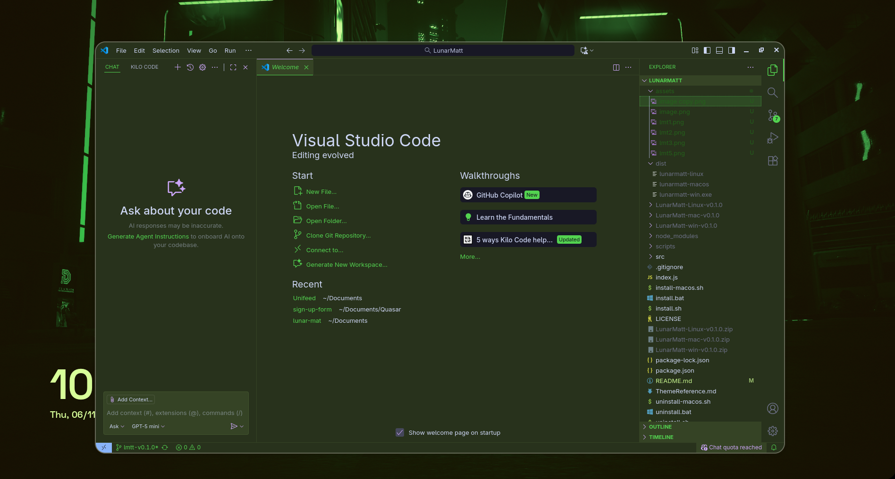

# 🌙 LunarMatt

Material You inspired adaptive wallpaper color extraction for VS Code with Catppuccin theming

<div align="center">

<span style="display:inline-block;">
  <a href="https://github.com/haxtechs/lunarmatt/releases/latest">
    
  </a>
</span>
<span style="display:inline-block;">
  <a href="https://opensource.org/licenses/MIT">
    
  </a>
</span>
<span style="display:inline-block;">
  <a href="https://github.com/haxtechs/lunarmatt">
    
  </a>
</span>

<div style="
    margin-top:20px;
    padding:20px;
    border-radius:15px;
    background: linear-gradient(135deg, 
        #d87227,  /* Vibrant */
        #59311e,  /* DarkVibrant */
        #f1868a,  /* LightVibrant */
        #9a5367,  /* Muted */
        #62344c,  /* DarkMuted */
        #ceaca4   /* LightMuted */
    );
    color:white;
    font-weight:bold;
    max-width:700px;
    text-align:center;
">
  Transform your VS Code with colors from your wallpaper – just like Android's Material You!
</div>

<div style="margin-top:10px;">
  <a href="#-features"></a>
  <a href="#-installation"></a>
  <a href="#-usage"></a>
  <a href="#-troubleshooting"></a>
</div>

</div>


---

## ✨ Features

- **Adaptive Colors** - Extracts vibrant colors from your wallpaper and generates matching VS Code theme
- **Dark & Light Modes** - Full support for Catppuccin Mocha (dark) and Latte (light)
- **Watch Mode** - Automatically updates theme when wallpaper changes
- **Smart Reset** - Safely removes customizations while preserving your other VS Code settings
- **Cross-Platform** - Works on Linux, macOS, and Windows
- **Non-Destructive** - Never overwrites your existing VS Code customizations
- **Catppuccin Base** - Built on top of the beautiful Catppuccin color scheme

### Supported Platforms & Wallpaper Managers

| Platform | Supported Tools |
|----------|----------------|
| **Linux** | Hyprland (swww, hyprpaper, quickshell, swaybg), GNOME, KDE Plasma, symlinks |
| **macOS** | Native wallpaper detection |
| **Windows** | Native wallpaper detection |

---
## 📸 Screenshots

Here are some examples of **LunarMatt** in action:

<p align="center">
  
  
</p>
<p align="center">
  
  
</p>

---

## 📥 Installation

### One-Line Installation (Recommended)

#### Linux
```bash
curl -L https://github.com/HaxTechs/LunarMatt/releases/download/v0.1.0/LunarMatt-Linux-v0.1.0.zip -o lunarmatt.zip && unzip lunarmatt.zip && cd LunarMatt-Linux-v0.1.0 && chmod +x install.sh && ./install.sh && cd .. && rm -rf LunarMatt-Linux-v0.1.0 lunarmatt.zip
```

#### macOS
```bash
curl -L https://github.com/HaxTechs/LunarMatt/releases/download/v0.1.0/LunarMatt-macOS-v0.1.0.zip -o lunarmatt.zip && unzip lunarmatt.zip && cd LunarMatt-macOS-v0.1.0 && chmod +x install.sh && ./install.sh && cd .. && rm -rf LunarMatt-macOS-v0.1.0 lunarmatt.zip
```

#### Windows (PowerShell - Run as Administrator)
```powershell
Invoke-WebRequest -Uri "https://github.com/HaxTechs/LunarMatt/releases/download/v0.1.0/LunarMatt-Windows-v0.1.0.zip" -OutFile "lunarmatt.zip"; Expand-Archive -Path "lunarmatt.zip" -DestinationPath "."; cd LunarMatt-Windows-v0.1.0; .\install.ps1; cd ..; Remove-Item -Recurse -Force LunarMatt-Windows-v0.1.0, lunarmatt.zip
```

### Manual Installation

1. Download the release for your platform:
   - [Linux](https://github.com/HaxTechs/LunarMatt/releases/download/v0.1.0/LunarMatt-Linux-v0.1.0.zip)
   - [macOS](https://github.com/HaxTechs/LunarMatt/releases/download/v0.1.0/LunarMatt-macOS-v0.1.0.zip)
   - [Windows](https://github.com/HaxTechs/LunarMatt/releases/download/v0.1.0/LunarMatt-Windows-v0.1.0.zip)

2. Extract the archive

3. Run the install script:
   ```bash
   # Linux/macOS
   cd LunarMatt-<Platform>-v0.1.0
   chmod +x install.sh
   ./install.sh
   
   # Windows (PowerShell as Admin)
   cd LunarMatt-Windows-v0.1.0
   .\install.ps1
   ```

### For Developers (npm)

```bash
git clone https://github.com/haxtechs/lunarmatt.git
cd lunarmatt
npm install
npm link
```

---

## 🚀 Usage

After installation, restart your terminal and use the `lunarmatt` command:

```bash
# Auto-detect wallpaper and apply dark theme
lunarmatt auto dark

# Auto-detect wallpaper and apply light theme
lunarmatt auto light

# Watch for wallpaper changes (auto-updates theme)
lunarmatt watch dark

# Use specific wallpaper file
lunarmatt /path/to/wallpaper.jpg dark

# Check current status
lunarmatt status

# Reset/remove customizations
lunarmatt reset

# Show help
lunarmatt help
```

### Command Reference

| Command | Description | Example |
|---------|-------------|---------|
| `auto <mode>` | Auto-detect wallpaper | `lunarmatt auto dark` |
| `watch <mode>` | Watch for changes | `lunarmatt watch light` |
| `<path> <mode>` | Use specific wallpaper | `lunarmatt ~/wall.jpg dark` |
| `reset` | Remove customizations | `lunarmatt reset` |
| `status` | Check current state | `lunarmatt status` |
| `help` | Show help | `lunarmatt help` |

**Modes:** `dark` (Catppuccin Mocha) or `light` (Catppuccin Latte)

---

## 📋 Requirements

### Essential
- ✅ **VS Code** - [Download](https://code.visualstudio.com/)
- ✅ **Catppuccin Theme** - [Install from Marketplace](https://marketplace.visualstudio.com/items?itemName=Catppuccin.catppuccin-vsc)

### Optional (for auto-detection on Linux)
- Create a symlink for manual wallpaper tracking:
  ```bash
  ln -sf /path/to/your/wallpaper.jpg ~/.current_wallpaper
  ```

---

## 🔧 How It Works

1. **🎨 Color Extraction**
   - Uses `node-vibrant` to analyze your wallpaper
   - Extracts vibrant, muted, light, and dark color variations

2. **🎨 Theme Generation**
   - Generates accent colors (primary, secondary, tertiary)
   - Creates surface colors for backgrounds and panels
   - Adjusts brightness and saturation for optimal contrast

3. **⚙️ VS Code Integration**
   - Applies colors as `workbench.colorCustomizations`
   - Overrides Catppuccin base theme with your wallpaper colors
   - Preserves your existing customizations

4. **🛡️ Safety First**
   - Adds a hidden marker to track our customizations
   - Never removes your personal settings
   - Clean reset removes only LunarMatt colors

### Customized Elements

LunarMatt customizes **135+ VS Code UI elements** including:

- 🖼️ Editor backgrounds, gutters, and line highlights
- 📊 Activity bar, status bar, and title bar
- 📁 Sidebars, panels, and tabs
- 🎨 Buttons, inputs, and dropdowns
- 🔍 Search highlights and selections
- 📝 Suggestions and hover widgets
- 🎯 Git decorations
- 💻 Terminal colors
- And many more!

See `ThemeReference.md` for a complete reference.

---

## 🆘 Troubleshooting

### Auto-detection not working?

**Linux (Hyprland/custom setups):**
```bash
# Option 1: Create symlink (recommended)
ln -sf /path/to/your/wallpaper.jpg ~/.current_wallpaper

# Option 2: Use manual path
lunarmatt /path/to/wallpaper.jpg dark
```

**Windows/macOS:**
- Ensure you're using the default system wallpaper setter
- Try providing the path manually

### Colors not applying?

1. **Restart VS Code** after running LunarMatt
2. **Check Catppuccin is installed:**
   - Open VS Code
   - Press `Ctrl/Cmd + Shift + P`
   - Type "Preferences: Color Theme"
   - Look for "Catppuccin Mocha" or "Catppuccin Latte"
3. **Check status:**
   ```bash
   lunarmatt status
   ```

### Still seeing LunarMatt colors after switching themes?

```bash
# Remove LunarMatt customizations
lunarmatt reset

# Then switch to your desired theme in VS Code
```

### Command not found after installation?

**Linux/macOS:**
```bash
# Reload shell configuration
source ~/.bashrc  # or ~/.zshrc, ~/.config/fish/config.fish

# Or restart your terminal
```

**Windows:**
- Restart PowerShell/Command Prompt
- Or restart your computer

### Permission errors?

**Linux/macOS:**
- The installer needs sudo access for system-wide installation
- Run `./install.sh` and enter your password when prompted

**Windows:**
- Right-click PowerShell → "Run as Administrator"
- Then run the install script

---

## 🗑️ Uninstallation

### Remove LunarMatt

**Linux:**
```bash
curl -L https://github.com/HaxTechs/LunarMatt/releases/download/v0.1.0/LunarMatt-Linux-v0.1.0.zip -o lunarmatt.zip && unzip lunarmatt.zip && cd LunarMatt-Linux-v0.1.0 && chmod +x uninstall.sh && ./uninstall.sh && cd .. && rm -rf LunarMatt-Linux-v0.1.0 lunarmatt.zip
```

**macOS:**
```bash
curl -L https://github.com/HaxTechs/LunarMatt/releases/download/v0.1.0/LunarMatt-macOS-v0.1.0.zip -o lunarmatt.zip && unzip lunarmatt.zip && cd LunarMatt-macOS-v0.1.0 && chmod +x uninstall.sh && ./uninstall.sh && cd .. && rm -rf LunarMatt-macOS-v0.1.0 lunarmatt.zip
```

**Windows (PowerShell as Admin):**
```powershell
Invoke-WebRequest -Uri "https://github.com/HaxTechs/LunarMatt/releases/download/v0.1.0/LunarMatt-Windows-v0.1.0.zip" -OutFile "lunarmatt.zip"; Expand-Archive -Path "lunarmatt.zip" -DestinationPath "."; cd LunarMatt-Windows-v0.1.0; .\uninstall.ps1; cd ..; Remove-Item -Recurse -Force LunarMatt-Windows-v0.1.0, lunarmatt.zip
```

### Reset VS Code Settings

Before uninstalling, remove LunarMatt customizations:
```bash
lunarmatt reset
```

---

## 💻 Development

### Building from Source

```bash
# Clone repository
git clone https://github.com/haxtechs/lunarmatt.git
cd lunarmatt

# Install dependencies
npm install

# Run in development mode
node index.js auto dark
node index.js watch dark

# Build binaries for all platforms
npm run build:all

# Build for specific platform
npm run build:linux
npm run build:macos  
npm run build:windows
```

### Project Structure

```
lunarmatt/
├── ThemeReference.md            # Color reference
├── index.js                     # Main entry point
├── src/
│   ├── core/                    # Core functionality
│   │   ├── ColorExtractor.js    # Color extraction
│   │   ├── ThemeGenerator.js    # Theme generation
│   │   ├── SettingsManager.js   # VS Code settings
│   │   └── WatchManager.js      # Watch mode
│   ├── utils/                   # Utilities
│   │   ├── ColorUtils.js        # Color manipulation
│   │   └── Logger.js            # Logging
│   ├── detectors/               # Wallpaper detection
│   │   ├── WindowsDetector.js
│   │   ├── MacDetector.js
│   │   ├── LinuxDetector.js
│   │   └── linux/               # Linux-specific
│   │       ├── HyprlandDetector.js
│   │       ├── GnomeDetector.js
│   │       ├── KdeDetector.js
│   │       └── SymlinkDetector.js
│   └── config/
│       └── constants.js         # Configuration
└── dist/                        # Built binaries
```

---

## 🤝 Contributing

Contributions are welcome! Whether it's bug reports, feature requests, or code contributions.

### How to Contribute

1. **Fork the repository**
2. **Clone your fork:**
   ```bash
   git clone https://github.com/<yourusername>/lunarmatt.git
   cd lunarmatt
   ```
3. **Install dependencies:**
   ```bash
   npm install
   ```
4. **Make your changes**
5. **Test thoroughly:**
   ```bash
   node index.js auto dark
   node index.js reset
   ```
6. **Submit a pull request** with a clear description

### Adding New Platform Support

To add support for a new desktop environment or wallpaper manager:

1. Create a detector in `src/detectors/` or `src/detectors/linux/`
2. Extend the `BaseDetector` class
3. Implement `detect()` and `isApplicable()` methods
4. Add to the appropriate detector list

**Example:**
```javascript
const BaseDetector = require('./BaseDetector');

class NewPlatformDetector extends BaseDetector {
  isApplicable() {
    // Check if this platform/tool is available
    return process.env.XDG_CURRENT_DESKTOP === 'NewPlatform';
  }

  async detect() {
    // Your detection logic here
    const wallpaperPath = // ... detect wallpaper
    return wallpaperPath;
  }

  getName() {
    return 'NewPlatform';
  }
}

module.exports = NewPlatformDetector;
```

---

## 📄 License

MIT License - see [LICENSE](LICENSE) file for details

---

## 🙏 Acknowledgments

- [node-vibrant](https://github.com/Vibrant-Colors/node-vibrant) - Color extraction
- [Catppuccin](https://github.com/catppuccin) - Beautiful color scheme
- [Material You](https://m3.material.io/) - Design inspiration

---

<div align="center">

**Made with ❤️ for the VS Code community**

[⭐ Star us on GitHub](https://github.com/haxtechs/lunarmatt) • [🐛 Report Issues](https://github.com/haxtechs/lunarmatt/issues) • [💬 Discussions](https://github.com/haxtechs/lunarmatt/discussions)

</div>